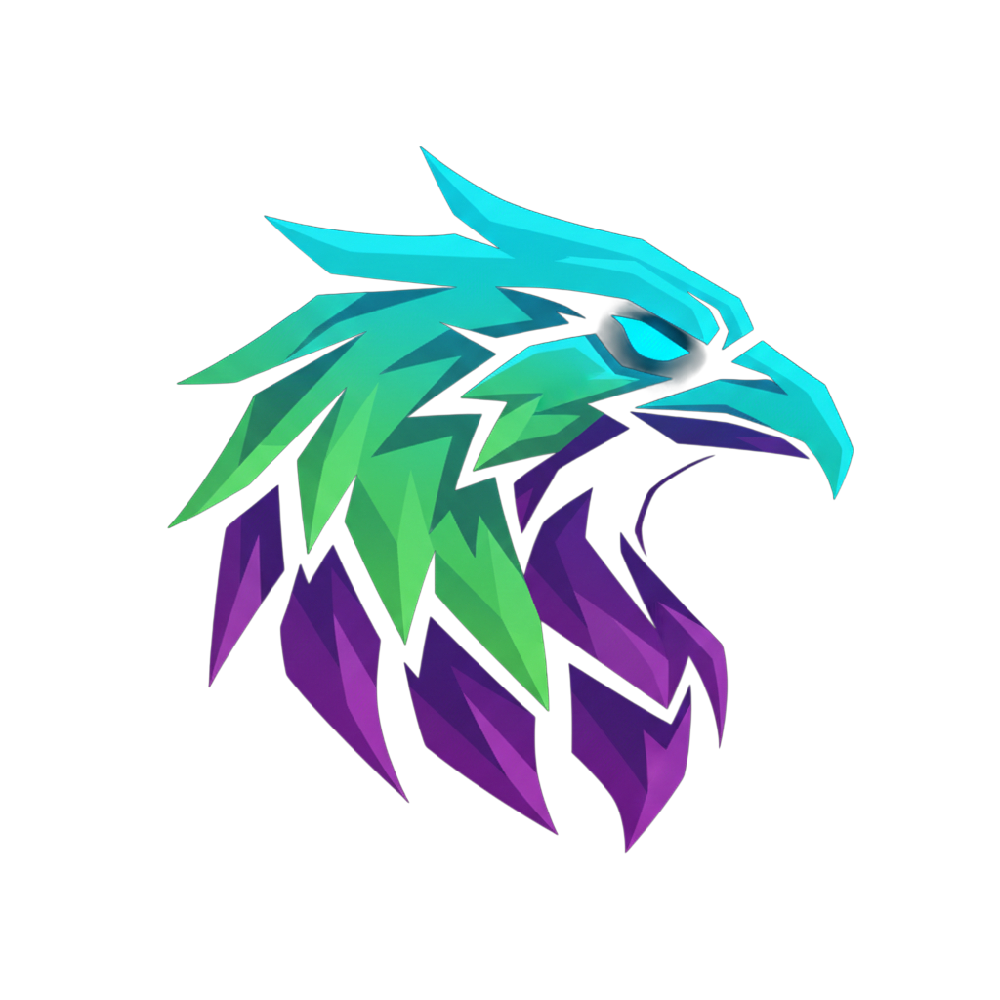

# Rally - Next-Generation Gaming & Social Platform

<p align="center">
  
</p>

<p align="center">
  <strong>The future of gaming communication.</strong><br/>
  Discord's community + Instagram's visuals + Twitter's discovery + Twitch's streaming
</p>

---

## Overview

Rally is a Windows desktop application that combines the best features of modern social and gaming platforms into one cohesive experience. Built with an aggressive esports aesthetic, Rally provides gamers with everything they need to communicate, share, discover, stream, and monetize.

## Features

### Core Communication
- **Text Channels** - Rich messaging with threading, reposts, reactions, and embeds
- **Voice Chat** - Crystal-clear voice with push-to-talk, audio mixer, and spatial audio positioning
- **Direct Messages** - Private messaging with optional E2E encryption
- **Server Management** - Create servers, channels, roles, and permissions

### Social Features (Instagram-inspired)
- **Visual Feed Channels** - Grid-layout media channels for screenshots and clips
- **Server Stories** - 24-hour ephemeral content for announcements and highlights
- **Like & Comment System** - Full social engagement on visual content

### Discovery (Twitter-inspired)
- **The Pulse** - Global discovery feed with hashtag system
- **Trending Topics** - Algorithmic content discovery across all servers
- **Viral Detection** - Smart scoring to surface the best community content

### Creator Tools (Twitch-inspired)
- **Integrated Streaming** - Go live directly from voice channels
- **Channel Points** - Redis-backed sub-millisecond point system with custom rewards
- **Raids & Drops** - Transfer viewers and distribute digital rewards
- **Leaderboards** - Track engagement across your community

### AI Community Manager
- **Claude AI Integration** - Powered by Anthropic's Claude
- **Auto-Summarize** - Catch up on missed conversations
- **Smart Moderation** - Context-aware content moderation
- **Personalized Welcome** - AI-generated welcome messages for new members
- **Activity Reports** - Automated server analytics

### Gaming Integration
- **Session Coordination** - Schedule and manage gaming sessions
- **Rally Call** - Quick notification to gather your squad
- **Game Detection** - Automatic game status updates
- **In-Game Overlay** - Minimal HUD for notifications (planned)

### Commerce
- **Digital Marketplace** - Sell digital products within servers
- **Subscription Tiers** - Creator subscription management
- **Revenue Dashboard** - Track sales and payouts

## Tech Stack

| Layer | Technology |
|-------|-----------|
| **Desktop Shell** | Electron 33 |
| **Frontend** | React 18 + TypeScript + Vite 6 |
| **Styling** | Tailwind CSS 3 + Custom esports theme |
| **State Management** | Zustand 5 |
| **Backend** | Node.js + Express + TypeScript |
| **Database** | PostgreSQL 16 (Prisma ORM) |
| **Cache/Real-time** | Redis 7 (ioredis) |
| **WebSocket** | Socket.IO 4 |
| **Voice/Video** | WebRTC (simple-peer) |
| **AI** | Anthropic Claude API |
| **Media Storage** | S3-compatible (MinIO) |
| **Payments** | Stripe |
| **Containerization** | Docker + Docker Compose |

## Architecture

```
┌─────────────────────────────────────────────────────┐
│                  Electron Shell                       │
│  ┌──────────────────────────────────────────────┐   │
│  │              React Frontend                    │   │
│  │  ┌─────────┬──────────┬──────────┬─────────┐ │   │
│  │  │ Server  │ Channel  │  Main    │  Right  │ │   │
│  │  │  List   │ Sidebar  │ Content  │  Panel  │ │   │
│  │  │         │          │          │         │ │   │
│  │  │ 72px    │  240px   │  flex-1  │  240px  │ │   │
│  │  └─────────┴──────────┴──────────┴─────────┘ │   │
│  └──────────────────────────────────────────────┘   │
└────────────────────┬────────────────────────────────┘
                     │ HTTP + WebSocket
┌────────────────────▼────────────────────────────────┐
│                 Nginx Reverse Proxy                   │
└───────┬────────────────┬────────────────┬───────────┘
        │                │                │
┌───────▼──────┐ ┌──────▼──────┐ ┌──────▼──────┐
│   Express    │ │  Socket.IO  │ │   WebRTC    │
│  REST API    │ │  Real-time  │ │  Signaling  │
└──────┬───────┘ └──────┬──────┘ └─────────────┘
       │                │
┌──────▼───────┐ ┌──────▼──────┐
│  PostgreSQL  │ │    Redis    │
│  (Prisma)    │ │  Pub/Sub    │
└──────────────┘ └─────────────┘
```

## Quick Start

### Prerequisites
- Node.js 20+
- Docker & Docker Compose
- Git

### 1. Clone and Setup

```bash
git clone <repository-url>
cd Rally
cp .env.example .env
# Edit .env with your configuration
```

### 2. Start Infrastructure (Docker)

```bash
docker-compose up -d postgres redis minio
```

### 3. Backend Setup

```bash
cd backend
npm install
npx prisma generate
npx prisma db push
npm run db:seed  # Optional: seed demo data
npm run dev
```

### 4. Frontend Setup

```bash
cd frontend
npm install
npm run dev
```

### 5. Access Rally

- **Web UI**: http://localhost:5173
- **API**: http://localhost:3001
- **Electron**: `npm run electron:dev` (from frontend directory)

### Build for Windows

```bash
cd frontend
npm run electron:build
# Output: frontend/release/Rally-Setup.exe
```

## Project Structure

```
Rally/
├── Logo/                      # Brand assets
│   ├── Rally.png
│   └── Rally.webp
├── backend/                   # API Server
│   ├── prisma/
│   │   ├── schema.prisma      # Database schema
│   │   └── seed.ts            # Demo data seeder
│   ├── src/
│   │   ├── config/            # Configuration
│   │   ├── lib/               # Prisma client, Redis
│   │   ├── middleware/        # Auth middleware
│   │   ├── routes/            # API endpoints
│   │   │   ├── auth.ts        # Authentication
│   │   │   ├── servers.ts     # Server management
│   │   │   ├── users.ts       # User profiles & DMs
│   │   │   ├── feed.ts        # Visual feed
│   │   │   ├── stories.ts     # Stories
│   │   │   ├── pulse.ts       # Global discovery
│   │   │   ├── points.ts      # Channel points
│   │   │   ├── stream.ts      # Streaming
│   │   │   ├── ai.ts          # Claude AI
│   │   │   ├── commerce.ts    # Marketplace
│   │   │   └── gaming.ts      # Gaming sessions
│   │   ├── services/          # Business logic
│   │   ├── socket/            # WebSocket handlers
│   │   ├── webrtc/            # WebRTC signaling
│   │   └── utils/             # Helpers
│   ├── Dockerfile
│   └── package.json
├── frontend/                  # Electron + React
│   ├── electron/
│   │   ├── main.cjs           # Electron main process
│   │   └── preload.cjs        # Preload script
│   ├── public/
│   │   ├── icon.png           # App icon
│   │   └── rally-logo.webp
│   ├── src/
│   │   ├── components/
│   │   │   ├── app/           # App shell
│   │   │   ├── chat/          # Messaging
│   │   │   ├── feed/          # Visual feed
│   │   │   ├── pulse/         # Discovery
│   │   │   ├── stories/       # Stories
│   │   │   ├── stream/        # Streaming
│   │   │   ├── voice/         # Voice chat
│   │   │   ├── ai/            # AI assistant
│   │   │   ├── commerce/      # Marketplace
│   │   │   ├── gaming/        # Gaming
│   │   │   ├── settings/      # User settings
│   │   │   └── ui/            # Shared components
│   │   ├── hooks/             # Custom hooks
│   │   ├── stores/            # Zustand stores
│   │   ├── lib/               # API client, utils
│   │   ├── pages/             # Route pages
│   │   └── styles/            # Global CSS
│   ├── Dockerfile
│   └── package.json
├── nginx/                     # Reverse proxy
├── docker-compose.yml
├── .env.example
└── README.md
```

## API Endpoints

| Route | Description |
|-------|-------------|
| `POST /api/auth/register` | Register new account |
| `POST /api/auth/login` | Login |
| `POST /api/auth/refresh` | Refresh access token |
| `GET /api/auth/me` | Get current user |
| `GET /api/servers` | List user's servers |
| `POST /api/servers` | Create server |
| `GET /api/servers/:id` | Get server details |
| `POST /api/servers/:id/join` | Join server |
| `GET /api/feed/:channelId/posts` | Get feed posts |
| `POST /api/feed/:channelId/posts` | Create feed post |
| `GET /api/pulse/feed` | Get discovery feed |
| `GET /api/pulse/trending` | Get trending hashtags |
| `GET /api/points/:serverId/balance` | Get point balance |
| `POST /api/points/:serverId/rewards/:id/redeem` | Redeem reward |
| `GET /api/stream/live` | Get live streams |
| `POST /api/ai/summarize` | AI channel summary |
| `POST /api/ai/chat` | AI assistant chat |
| `GET /api/commerce/server/:id/products` | List products |
| `POST /api/gaming/rally` | Send rally call |

## WebSocket Events

| Event | Direction | Description |
|-------|-----------|-------------|
| `message:send` | Client → Server | Send message |
| `message:new` | Server → Client | New message |
| `message:reaction` | Client → Server | Toggle reaction |
| `voice:join` | Client → Server | Join voice channel |
| `voice:leave` | Client → Server | Leave voice channel |
| `voice:signal` | Bidirectional | WebRTC signaling |
| `typing:start` | Client → Server | Start typing |
| `presence:update` | Client → Server | Update status |
| `stream:start` | Client → Server | Start streaming |
| `dm:send` | Client → Server | Send DM |

## Database Schema

The database includes 25+ models covering:
- **Users & Auth** - User accounts, sessions, friend requests
- **Servers & Channels** - Servers, channels, roles, permissions
- **Messaging** - Messages, DMs, conversations
- **Visual Feed** - Posts, likes, comments (Instagram-style)
- **Stories** - Ephemeral content with 24hr TTL
- **The Pulse** - Global discovery posts, trending hashtags
- **Streaming** - Stream sessions, channel points, rewards
- **AI** - Server configs, interaction logs
- **Gaming** - Game sessions, member tracking
- **Commerce** - Products, purchases, subscriptions
- **Notifications** - Multi-type notification system

## Brand Guidelines

### Colors
| Name | Hex | Usage |
|------|-----|-------|
| Electric Blue | `#00D9FF` | Primary, CTAs, highlights |
| Toxic Green | `#39FF14` | Success, online status, secondary |
| Deep Purple | `#8B00FF` → `#4B0082` | Accent gradients |
| Pure Black | `#000000` | Primary background |
| Dark Navy | `#0A0E27` | Sidebar backgrounds |
| Hot Magenta | `#FF006E` | Danger, likes, DND |
| Neon Cyan | `#00F0FF` | Alternative highlight |

### Typography
- **Display**: Rajdhani (headings, titles)
- **Body**: Exo 2 (body text, UI)
- **Mono**: JetBrains Mono (code blocks)

### Design Principles
- Sharp, angular shapes (clip-path polygons)
- Neon glow effects on interactive elements
- Dark backgrounds with subtle grid patterns
- Gradient borders on cards and containers
- Esports-focused, competitive aesthetic

## Environment Variables

See `.env.example` for all configuration options including:
- Database and Redis connection URLs
- JWT secrets and expiration settings
- Anthropic API key for Claude AI
- S3/MinIO configuration for media storage
- Stripe keys for commerce
- WebRTC/TURN server configuration

## License

Proprietary - All rights reserved.
